# Assessment Task: Object-Oriented Programming - Carpark System

## Overview

In this assessment, you are required to design and implement a simplified carpark system using Object-Oriented Programming (OOP) concepts in Python. The system will consist of a Carpark, Sensors, and Displays to track the cars entering and exiting and the availability of parking bays.

## Objectives

By completing this task, you will demonstrate the following competencies as outlined in ICTPRG430:

1. **Modularity**: Implementing the logic for one object operation using a modular approach.
2. **Data Structures**: Utilizing s of primitive data types within a class.
3. **File Operations**: Reading from and writing to a text file.
4. **Class Design**: Developing two classes with four instance variables each.
5. **Object Construction**: Creating a class that offers two options for object construction.
6. **Object Aggregation**: Employing user-defined object aggregation within a class.
7. **Polymorphism**: Implementing polymorphism to enhance code extensibility.
8. **Debugging**: Utilizing a debugging tool to troubleshoot your code.
9. **Code and Documentation Conventions**: Applying specified coding and documentation standards.
10. **Unit Testing**: Conducting and documenting two unit test cases.

## Task Requirements

1. **Carpark Class**:
   - Implement a `Carpark` class with instance variables for location, capacity, current vehicle count, and an  of `Sensor` objects.
   - Include methods to increment/decrement the vehicle count and to update the display.
   - The class should have two constructors: one default and one that allows setting the initial values of the instance variables.

2. **Sensor Class**:
   - Create a `Sensor` class with instance variables for ID, status, location, and type.
   - Implement methods to activate/deactivate the sensor and detect a car's presence.
   - The `Sensor` class should interact with the `Carpark` class to update the vehicle count and availability of bays.

3. **Display Class**:
   - Design a `Display` class with instance variables for ID, message, status, and an  of `Carpark` data.
   - This class should have a method to display the current number of available parking bays.

4. **Aggregation**:
   - Use aggregation in the `Display` class to hold information about the `Carpark` class, showing the relationship between them.

5. **Polymorphism**:
   - Implement polymorphism by creating a method that can be overridden in a subclass to provide different display messages.

6. **File Operations**:
   - Implement file reading and writing in the `Carpark` class to log the entry and exit times of cars.

7. **Debugging**:
   - Utilize a debugging tool of your choice (e.g., Pycharm's debugger) to debug your classes.

8. **Documentation Conventions**:
   - Ensure that your code is well-documented, including comments for classes and methods, and use consistent naming conventions for variables and functions.
   - Specify at least three documentation aspects according to the organizational standards provided in the task brief.

9. **Unit Testing**:
   - Write two unit tests to verify that the `Sensor` and `Display` classes are functioning as expected.

## Version control requirements

As part of this assessment, you will demonstrate competencies in using a version control system as outlined in ICTICT449. You will plan, install, create, and manage a repository to control versions of your code for the Carpark system.

- Create a new repository and configure it with a README, .gitignore, and other essential setup files.
- Initialize your local repository and link it to a remote repository on GitHub.
- Make initial commits with the basic structure of your Carpark system.
- As you develop the system, commit your changes each time you reach a significant milestone or complete a task.
- Make at least three commits to demonstrate the evolution of your project.
- Manage any changes or improvements by committing to the repository with clear, descriptive commit messages.

## Scaffolding

1. Begin by outlining the classes and their relationships.
2. Pseudocode can help map out the logic before actual coding.
3. Use comments to mark sections where file operations and s are used.
4. Develop a simple flowchart to illustrate object interactions within the system.
5. Example code snippets will be provided to guide the construction of methods for reading/writing files and for implementing constructors.

## Submission

Your final submission should include:

- Python script files for each class in a zip file.
- Your `.git/` should be included with your zip file.
- Your `.gitignore` file should exclude any files that are not required for marking
- Your `venv/` should **not** be included in your submission.
- A text file used for logging car entries/exits.
- This worksheet, completed with your documentation.

## Assessment Criteria

You will be assessed on:

- The correct implementation of OOP concepts.
- Code functionality and adherence to the provided specifications.
- Quality and clarity of code documentation.
- Successful execution and documentation of unit tests.

## Instructions

### Set up version control

1. Create a new repository on GitHub. Initialize it with a `README.md`, .`gitignore`, and optionally a license.
2. Clone the repository to your local machine.
3. Update the `README.md` file with a brief description of the project.
4. Modify the `.gitignore` file to exclude the `.idea/` folder. This folder is created by Pycharm and contains project-specific settings that should not be shared.
5. Create a virtual environment for your project. This will allow you to install packages without affecting other projects on your machine.

   ```bash
   python -m venv venv
   
   # On Windows cmd:
   venv\Scripts\activate.bat
   
   # On Git Bash:
   source venv/Scripts/activate
   
   # On any other OS:
   source venv/bin/activate
   ```

6. Open the project folder in Pycharm. Pycharm will detect the virtual environment and use it for the project.
7. Create a `src` and `tests` directories in your project. The `src` directory will contain your Python scripts, and the `tests` directory will contain your unit tests. Your project structure should look like this:

   ```bash
   ipriot-carpark-prj/
   ├── .git/
   ├── venv/
   ├── .gitignore
   ├── README.md
   ├── src/
   └── tests/
   ```

8. Create a new Python file in the `src` directory called `main.py`. This will be the main script for your Carpark system.
9. Create a new Python file in the `tests` directory called `test_carpark.py`. This will be the main script for your unit tests.
10. In PyCharm, mark the `src` directory as a source root. This will allow you to import modules from the `src` directory in your unit tests; mark the `tests` directory as a test root. This will allow you to run your unit tests from the IDE.
11. Commit your changes to the repository, both locally and remotely:

      ```bash
      git add .
      git commit -m "Initial commit"
      git push
      ```

**Evidencing:**
Include a screenshot of your GitHub repository **after** you have pushed your initial commit.

```text
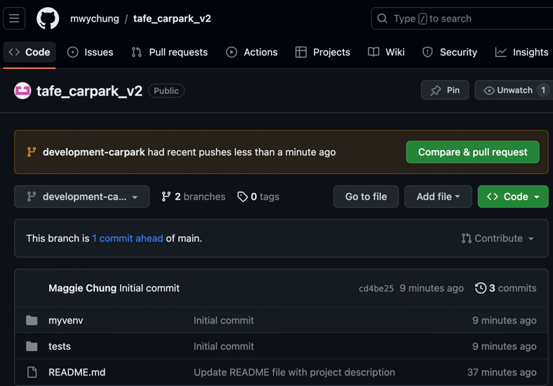

```

### Identify classes, methods, and attributes

After reading the task requirements, you should be able to identify the classes, methods, and attributes required for the Carpark system. Complete the following table with the classes, methods, and attributes you will need to implement.

| Class Name | Attributes | Methods |
| ---------- | ---------- | ------- |
| `Carpark`    |            |         |
| `Sensor`     |            |         |
| `Display`    |            |         |
| `Config`     |            |         |

**Evidencing:**
Ensure that you have completed the previous table and include at least two methods, and two attributes for each.

### Implement stubs for the classes

1. In your `src/` directory, create a new Python file for each class you identified in the previous step. For example, `carpark.py`, `sensor.py`, `display.py`, and `config.py`.
   Notice that the file names are all lowercase and use underscores to separate words. This is a common convention for Python file names.
2. In each file, create a class with the same name as the file. For example, the `carpark.py` file should contain a `Carpark` class. Notice that the class name is capitalized and uses CamelCase to separate words. This is a common convention for Python class names. An example class definition is shown below:

   ```python
   class Carpark:
       pass
   ```

3. Commit your changes to the repository, both locally and remotely:

      ```bash
      git add .
      git commit -m "Added stubs for classes"
      git push
      ```

**Evidencing:**
Include a screenshot of your GitHub repository `src/` directory **after** you have pushed your changes
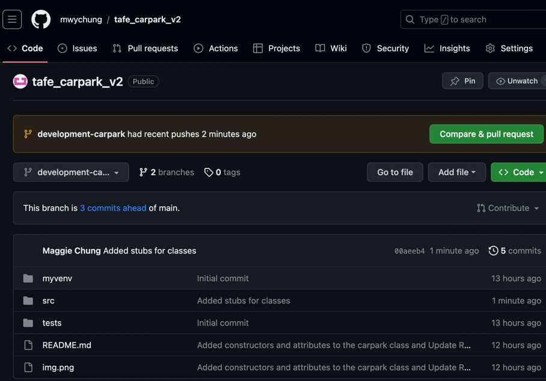
```text

```

### Add constructors and attributes to the classes

#### Carpark class

1. Create an `__init__` method for the `Carpark` class. This method will be called when a new `Carpark` object is created. The method should accept the following parameters:
   - `location`
   - `capacity`
   - `current_vehicle_count`
   - `sensors`
   - `displays`
2. Add instance variables for each of the parameters. For example, `self.location = location`.
3. Add a default value for each parameter. For example, `location = "Unknown"`.
4. Notice that sensors and displays are lists ("s"). This is because a carpark can have multiple sensors and displays. Add an empty list for each of these parameters. For example, `self.sensors = []`. However, lists are mutable and we must never set mutable defaults for parameters. So make the defaults `None`.
5. Add a `__str__` method to the `Carpark` class. This method will be called when you print a `Carpark` object. The method should return a string containing the carpark's location and capacity. For example, `"Carpark at 123 Example Street, with 100 bays."`.
6. Your carpark class should now look similar to this:

   ```python
   class Carpark:
      def __init__(self, location="Unknown", capacity=0, current_vehicle_count=0, sensors=None, displays=None):
         self.location = location
         self.sensors = sensors or [] # uses the first value if not None, otherwise uses the second value
         ... # Add the other parameters here
      
      def __str__(self):
         ... # Return a string containing the carpark's location and capacity
   ```

7. Commit your changes to the repository locally and add a tag so your lecturer can find it. A tag is a way to mark a specific commit as important. You can use tags to mark milestones in your project, often marking releases. You will use it to mark specific commits for your lecturer to review.

   ```bash
   git add .
   git commit -m "Added constructors and attributes to the carpark class"
   git tag -a "s1" -m "Added a constructor and attributes to the carpark class"
   ```

#### Display class

1. Create an `__init__` method for the `Display` class. This method will be called when a new `Display` object is created. The method should accept the following parameters:
   - `id`
   - `message`
   - `is_on`
   - `carpark`
2. Add instance variables for each of the parameters. For example, `self.id = id`.
3. Add default values for parameters, such that there is no default for id or carpark, but there is a default for message and status. For example, `message = ""` and `is_on = False`.
4. Create a `__str__` method for the `Display` class. This method will be called when you print a `Display` object. The method should return a string containing the display's id and message. For example, `"Display 1: Welcome to the carpark."`.

#### Sensor class

1. Create an `__init__` method for the `Sensor` class. This method will be called when a new `Sensor` object is created. The method should accept the following parameters:
   - `id`
   - `is_active`
   - `carpark`

   You realize that you need to distinguish between entry and exit sensors. Since each of those sensors will need different methods, you decide to subclass the `Sensor` class.

2. Create a new class called `EntrySensor` that inherits from `Sensor`. The `EntrySensor` class should **not** have an `__init__` method.
Do the same for the `ExitSensor` class.

   Your `sensor.py` file should now look similar to this:

   ```python
   class Sensor:
      def __init__(self, id ...): # Add the other parameters
         self.id = id
         self.is_active = is_active
         ... # Add the other attributes

      def __str__(self):
         ... # Return a string containing the sensor's id and status

   class EntrySensor(Sensor):
      ...

   # Also create an ExitSensor class
   ```

3. Commit your changes to the local repository and add a tag so your lecturer can find it:

   ```bash
   git add .
   git commit -m "Added constructors and attributes to the display and sensor classes"
   git tag -a "s2" -m "Added constructors and attributes to the display and sensor classes"
   ```

4. Now push your **tagged** changes to the remote repository:

   ```bash
   git push --tags
   ```

#### Config class

You realize that you need a way to configure the carpark system. You decide to create a `Config` class to store the configuration data. However, you want to have a firmer grasp of the requirements before you implement the class. So you skip this step for now.

--------
**Evidencing:**
Ensure that you have completed the previous steps and created the appropriate tags. Confirm that the tags have been created by running `git tag` in the terminal and provide a screenshot of the output.

```text
[student@workstation ipriot-carpark-prj]$ git tag
s1
s2
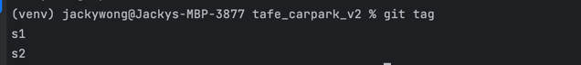
```

### Relate the classes

Let's consider how the classes relate to each other. We can start by using a sequence diagram to illustrate the interactions between the classes. A sequence diagram shows the interactions between objects in a sequential order. The following diagram shows the interactions between the `Carpark`, `Sensor`, and `Display` classes.

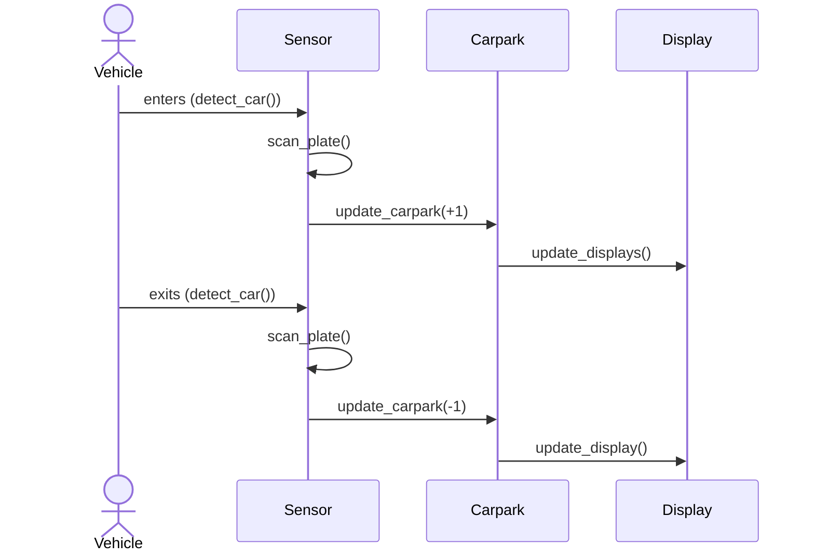
```mermaid
sequenceDiagram
    actor v as Vehicle
    participant s as Sensor
    participant c as Carpark
    participant d as Display
    v->>s: enters (detect_car())
    s->>s: scan_plate()
    s->>c: update_carpark(+1)
    c->>d: update_displays()
    v->>s: exits (detect_car())
    s->>s: scan_plate()
    s->>c: update_carpark(-1)
    c->>d: update_display()
```

Notice a sensor detects cars and notifies a carpark. The carpark then updates the displays. Sensors connect **to** a carpark and a carpark connects **to** displays.

In other words, a sensor needs to know about a carpark, and a carpark needs to know about displays. This is an example of aggregation, where one object holds a reference to another object. In this case, the `Carpark` class holds a reference to instances of the `Display` classes (aggregation); sensors for their part hold a reference to a carpark.

The following class diagram presents this relationship:

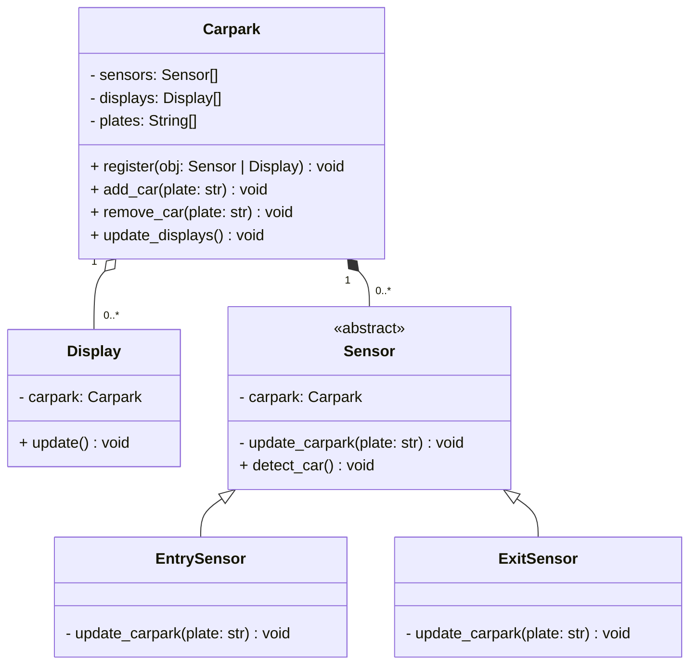
```mermaid
classDiagram
      Carpark "1" o-- "0..*" Display
      Carpark "1" *-- "0..*" Sensor
      Sensor <|-- EntrySensor
      Sensor <|-- ExitSensor 
      

      class Carpark {
         - sensors: Sensor[]
         - displays: Display[]
         - plates: String[]
         + register(obj: Sensor | Display) void
         + add_car(plate: str) void
         + remove_car(plate: str) void 
         + update_displays() void
      }
      class Sensor {
         <<abstract>>
         - carpark: Carpark
         - update_carpark(plate: str) void
         + detect_car() void
      }
      class EntrySensor{
         - update_carpark(plate: str) void

      }
      class ExitSensor{
         - update_carpark(plate: str) void
      }
      class Display {
         - carpark: Carpark
         + update() void
      }
```

The diagram omits methods and attributes that are not relevant to the relationship between the classes. Notice that the `Carpark` class has a `register` method that allows it to register sensors and displays.

Notice also that displays and sensors reference a carpark and a carpark references displays. This kind of two way relationship is not always advisable. But for this project, it is acceptable.

### Implement methods for the Carpark class

Our analysis shows that the carpark will need to implement the following methods:

- `register`: This method will allow the carpark to register sensors and displays.
- `add_car`: This method will be called when a car enters the carpark. It will record the plate number and update the displays.
- `remove_car`: This method will be called when a car exits the carpark. It will remove the plate number and update the displays.
- `update_displays`: This method will be called when the carpark needs to update the displays. It will iterate through the displays and call their `update` method.

As we implement these methods, we may find we need additional methods and attributes. For example, we may need a method to check if a plate number is already in the carpark. We may also need an attribute to store the plate numbers. We can add these as we go.

We will focus on these key principles to guide the need for additional methods and attributes:

- **Encapsulation**: We want to hide the implementation details of the class from other classes. We can do this by making attributes private and only exposing them through methods.
- **Single Responsibility**: We want each method to have a single responsibility. This will make the code easier to understand and maintain.
- **DRY**: We want to avoid repeating code or information about state (Don't Repeat Yourself). We can do this by creating methods and attributes for behaviors and values that are repeated.

---

#### Register method

1. Create a `register` method for the `Carpark` class. This method should accept a single parameter, `component`. This parameter will be either a `Sensor` or `Display` object.
2. If the `component` is a `Sensor`, add it to the `sensors` . If the `component` is a `Display`, add it to the `displays` list.
3. If the `component` is neither a `Sensor` nor a `Display`, raise a `TypeError` with the message `"Object must be a Sensor or Display"`.

**Stuck?**
Here are some some hints to help you complete this task:

Even though we often think of exceptions last, we generally want to put them first in our method definitions. This is because exceptions are exceptional. We want to handle them first and then handle the normal flow of the method. This is called a **guard pattern** and is a common pattern in Python and other languages.
Let's do that now. Add the following code to the top of the `register` method:

   ```python
   # ... inside the Carpark class
   def register(self, component):
      if not isinstance(component, (Sensor, Display)):
         raise TypeError("Object must be a Sensor or Display")
   ```

The `isinstance` function checks if an object is an instance of a class. In this case, we are checking if the `component` is an instance of either the `Sensor` or `Display` class. Notice, that we'll need to import the `Sensor` and `Display` classes to use them in the `isinstance` function. Add the following import statement to the top of the `carpark.py` file:

   ```python
   from sensor import Sensor
   from display import Display
   ```

Now we can add the code to add the `component` to the appropriate . Add the following code to the `register` method:

   ```python
   # ... inside the register method
   if isinstance(component, Sensor):
      self.sensors.append(component)
   # add an elif to check if the component is a Display
   ```

**Evidencing:**
After you have implemented the required code, commit your changes to the local repository and add a tag so your lecturer can find it:

   ```bash
   git add .
   git commit -m "Added a register method to the carpark class"
   git tag -a "s3" -m "Added a register method to the carpark class"
   ```
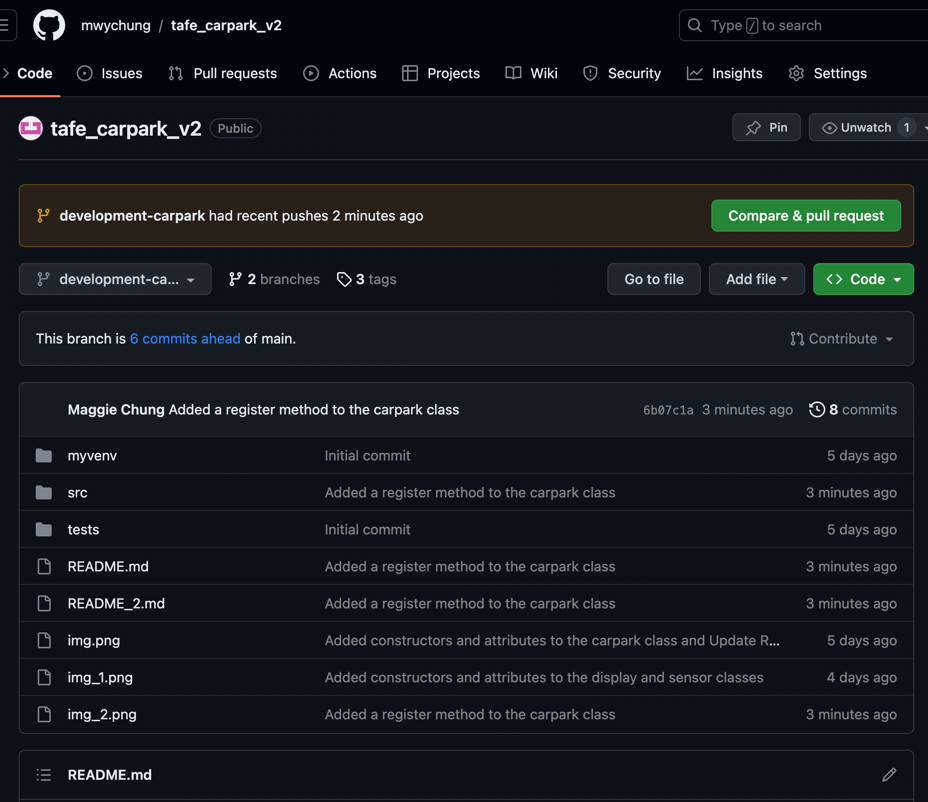

#### Add and remove car methods

When a car enters the carpark, we record its plate number and update the displays. When a car exits the carpark, we remove its plate number and update the displays. We can implement these behaviors in the `add_car` and `remove_car` methods.

1. In the Carpark class, create an `add_car` method. This method should accept a single parameter, `plate`. This parameter will be a string containing the car's plate number.
2. Append the `plate` to the `plates` list (`self.plates.append(plate)`).
3. Call the `update_displays` method.
   Hang on, we haven't implemented the `update_displays` method yet. We'll do that next.
   Here is a sample implementation of the `add_car` method:

      ```python
      # ... inside the Carpark class
      def add_car(self, plate):
         self.plates.append(plate)
         self.update_displays()
      ```

4. Repeat the previous steps to implement the `remove_car` method. This method also accepts a single parameter, `plate` and also calls `update_displays`. However, this method should remove the plate from `self.plates`.

#### Update displays method

Finally, we are going to create the `update_displays` method. This method will iterate through the `displays` list and call the `update` method on each display. Before we proceed, consider, as a driver, what information you would like to see when you enter a carpark.

You may want to see the number of available bays, the current temperature, and the time.

Now consider, between the `Carpark`, `Sensor`, and `Display` classes, which class is responsible for each of these pieces of information? There's no right or wrong answer here. But you should be able to justify your answer.

Q. Which class is responsible for the number of available bays (and why)?
Q. Which class is responsible for the current temperature (and why)?
Q. Which class is responsible for the time (and why)?

--------

##### Detour: implement available bays

You realize that you are not currently maintaining the number of available bays. The number of available bays is a curious case. This value, on the one hand, clearly seems like an attribute of the carpark. However, it is also a **property** of the carpark's capacity and the number of cars in the carpark. In other words, it is a **derived** value. We can calculate the number of available bays by subtracting the number of cars from the capacity. We can do this in the `Carpark` class by adding a `get_available_bays` method. This method will return the number of available bays.

But you're not comfortable with this, because even though you are deriving the value through a calculation it still seems like an attribute. Python has a built-in way to treat a method as though it is a simple attribute. We can use it to protect values as well as make attributes derived via simple calculations easier to access. Fittingly, it is called a **property**. We can create a property by adding a `@property` decorator (we'll learn more about decorators in the diploma) to a method. While we don't yet fully understand decorators, the important thing is that they make a method act like an attribute.

Let's add `available_bays` as a property now:

```python
      # ... inside the Carpark class
      @property
      def available_bays(self):
         return self.capacity - len(self.plates)
```

Notice that we did **not** use a verb in a property name. This is because properties are accessed like attributes. For example, `carpark.available_bays` instead of `carpark.get_available_bays()`.

An added bonus is that if someone accidentally tries to set the value to this property, they will get an error. This is because we have not defined a property setter, and this is a good thing in this case.

You recognize an issue: what if the number of cars that entered exceeds capacity?

We might not be able to stop this from happening!

But what should happen if it does? Do we want to allow the number of available bays to be negative? Or should we set it to zero? Or should we raise an exception? Something else??

You discuss with the senior developer and decide that if the number of plates exceeds the capacity you will return 0.

> Modify the `available_bays` property to return 0 if the number of plates exceeds the capacity.

--------

#### Back to the update displays method

The `update_displays` method shall send status information: available bays, temperature, and any other relevant information to each display. We will implement this method in the `Carpark` class.

1. Create an `update_displays` method in the `Carpark` class. This method only needs to accept the `self` parameter.
2. Build a dictionary containing the information you want to send to the displays. For example, `data = {"available_bays": self.available_bays, "temperature": 25}`.
3. Iterate through the `displays` list and call the `update` method on each display. For example, `for display in self.displays: display.update(data)`.
4. Create a `update` method for the `Display` class. This method should accept a single parameter, `data`. For now, we will simply print the keys and values. Here is a sample implementation:

   ```python
   # ... inside the Display class
   def update(self, data):
      for key, value in data.items():
         print(f"{key}: {value}")
   ```

**Evidencing:**
After you have implemented the required code, commit your changes to the local repository and add a tag so your lecturer can find it:

   ```bash
   git add .
   git commit -m "Added methods to the carpark class"
   git tag -a "s4" -m "Added methods to the carpark class"
   ```

This time, we will push the tag to the remote repository:

   ```bash
   git push --tags
   ```

Add a screenshot of the GitHub repository after pushing the tag, showing the Carpark class with the new methods:

```text
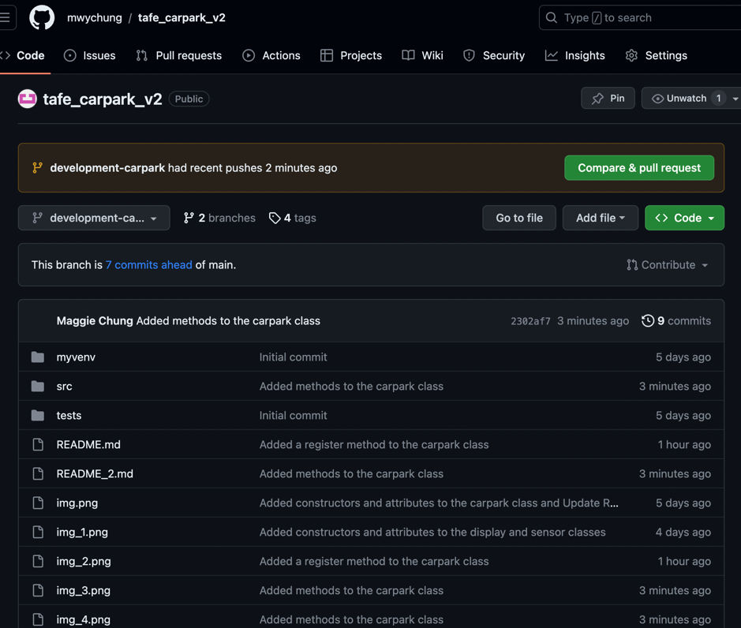

```

Answer the following questions:

```text
   1. Which class is responsible for each of the following pieces of information (and why)?
      - The number of available bays
      Carpark class is responsible for the number of available bays as its calculation is based on the carpark capacity and the current number of car in carpark.
      
      - The current temperature
      Depends
      to be updated 
      
      - The time
      Carpark class can hold the responsible for the time by import time in carpark.py.
      (reference:https://www.programiz.com/python-programming/time)
   2. What is the difference between an attribute and a property?
        to be updated
   3. Why do you think we used a dictionary to hold the data we passed the display? List at least one advantage and one disadvantage of this approach
        to be updated

```

#### Add a detect vehicle method to the Sensor class

A sensor detects a vehicle, scans the plate, and notifies the carpark. The Sensor class is specialized by the EntrySensor and ExitSensor classes. We will implement the `detect_vehicle` method in the `EntrySensor` and `ExitSensor` classes.

The Sensor superclass is abstract, meaning we don't expect it to be instantiated. However, we can still implement methods in the superclass. We will implement the `detect_vehicle` method in the `Sensor` class. The `detect_vehicle` method will be called when a vehicle is detected. It will scan the plate and the call the `update_carpark` method.

The `update_carpark` method should be implemented in the `EntrySensor` and `ExitSensor` classes. This method will be called by the `detect_vehicle` method. Since the implementation will be determined by the subclass, this is an example of polymorphism.

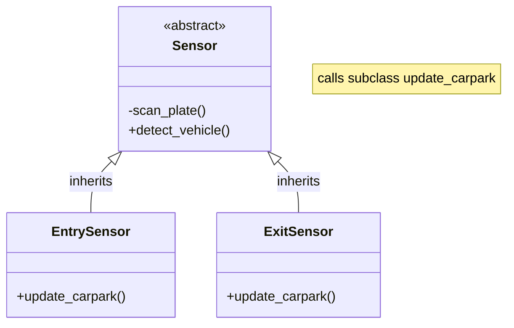
```mermaid
classDiagram
        class Sensor {
        <<abstract>>
        -scan_plate()
        +detect_vehicle()
    }
    note "calls subclass update_carpark"
    
    class EntrySensor {
        +update_carpark()
    }
    class ExitSensor {
        +update_carpark()
    }
    Sensor <|-- EntrySensor : inherits
    Sensor <|-- ExitSensor : inherits
```

1. Open `sensor.py`, add the following import statement to the top of the file:

   ```python
   from car_park import Carpark
   from abc import ABC, abstractmethod
   ```

2. Update the class declaration to inherit from ABC: `class Sensor(ABC):`.
3. Add an `update_carpark` method to the `Sensor` class. This method should accept a single parameter, `plate`. This method should be abstract, meaning it should not be implemented in the superclass and must be implemented by a subclass. We can do this by adding the `@abstractmethod` decorator to the method. Here is a sample implementation:

   ```python
   # ... inside the Sensor class
   @abstractmethod
   def update_carpark(self, plate):
      pass
   ```

4. Create a private method called `scan_plate`. The method should return a plate. For now, we will simply return a random plate. Here is a sample implementation:

   ```python
   # ... inside the Sensor class
   def _scan_plate(self):
      return 'FAKE-' + format(random.randint(0, 999), "03d")
   ```

5. Create a `detect_vehicle` method **in the Sensor class**. The method includes the following steps:
   - Call the `scan_plate` method to get the plate.
   - Call the `update_carpark` method with the plate.
   Notice that the `update_carpark` method is abstract. It is **not** implemented in the `Sensor` class. This is because the implementation will be determined by the subclass.
   Here is a proposed implementation:

   ```python
      # ... inside the Sensor class
   def detect_vehicle(self):
      plate = self._scan_plate()
      self.update_carpark(plate)
   ```

6. Now, let's implement update_carpark in the EntrySensor class. This method should accept a single parameter, `plate`. Here is a sample implementation:

   ```python
   # ... inside the EntrySensor class
   def update_carpark(self, plate):
      self.carpark.add_car(plate)
      print(f"Incoming 🚘 vehicle detected. Plate: {plate}")
   ```

7. Let's do the same for the ExitSensor:

   ```python
   # ... inside the ExitSensor class
   def update_carpark(self, plate):
      self.carpark.remove_car(plate)
      print(f"Outgoing 🚗 vehicle detected. Plate: {plate}")
   ```

Normally, we'd be done. But the astute among you may have identified a problem: we can generate a random license plate for cars entering, but not cars that are exiting. Remember this is not a real-world problem, just a problem causes by us not having a "real" plate sensor.

So just for this simulation we will override the _scan_plate method to return a plate at random from the carpark. This is a bit of a hack, but it will work for our purposes.

```python
# ... inside the ExitSensor class
def _scan_plate(self):
   return random.choice(self.carpark.plates)
```

**Evidencing:**
After you have implemented the required code, commit your changes to the local repository and add a tag so your lecturer can find it:

   ```bash
   git add .
   git commit -m "Created core methods for the classes"
   git tag -a "s5" -m "Core methods completed"
   ```

Probably a good idea to commit to GitHub now:

   ```bash
   git push --tags
   ```
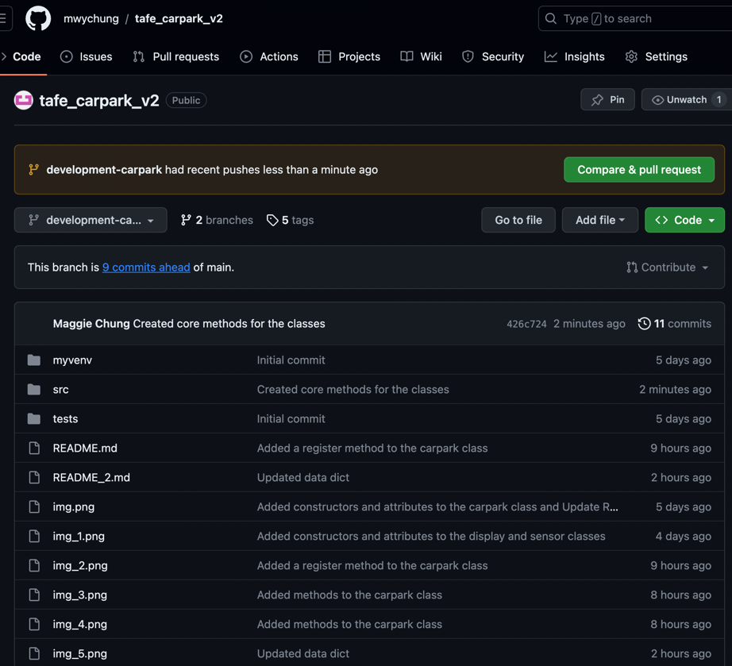
-----------
Taking stock
Let's take stock of what we've done up till now. Diagrammatically, here is a representation of all the classes, methods, and attributes we have implemented so far in the project:
classDiagram
    class CarPark {
        -location: string
        -capacity: int
        -plates: str[]
        -sensors: Sensor[]
        -displays: Display[]
        __init__(location, capacity, plates, sensors, displays)
        register(component: Sensor | Display)
        add_car(plate: string)
        remove_car(plate: string)
        update_displays()
        property: available_bays: int 
    }

    class Sensor {
        <<abstract>>
        -id: int
        -is_active: bool
        -car_park: CarPark
        __init__(id, is_active, car_park)
        -scan_plate(): string
        detect_vehicle()
        update_car_park(plate: string)
    }

    class EntrySensor {
        inherit Sensor
        update_car_park(plate: string)
        
    }

    class ExitSensor {
        inherit Sensor
        +update_car_park(plate: string)
        -scan_plate() string
    }

    class Display {
        -id: int
        -message: string
        -is_on: bool
        -car_park: CarPark
        __init__(id, message, is_on, car_park)
        update(data: dictionary)
    }

    CarPark "1" o-- "0..*" Display : contains
    CarPark "1" *-- "0..*" Sensor : contains
    Sensor <|-- EntrySensor
    Sensor <|-- ExitSensor 


Take a moment to review the diagram and ensure you have implemented the classes, methods, and attributes correctly. You're about to find out if you haven't!

Implement unit tests
The first set of unit tests are given to you below. We use the unittest module to create unit tests. The unittest module provides a base class, TestCase, which we can use to create test cases. We can then use the assert methods to test the behaviour of our classes.

CarPark unit tests
The following unit tests test the CarPark class. They test the __init__ method, the add_car method, and the remove_car method. Notice that we use the setUp method to create a CarPark object before each test. This ensures that each test starts with a fresh CarPark object.

import unittest
from car_park import CarPark

class TestCarPark(unittest.TestCase):
      def setUp(self):
         self.car_park = CarPark("123 Example Street", 100)
   
      def test_car_park_initialized_with_all_attributes(self):
         self.assertIsInstance(self.car_park, CarPark)
         self.assertEqual(self.car_park.location, "123 Example Street")
         self.assertEqual(self.car_park.capacity, 100)
         self.assertEqual(self.car_park.plates, [])
         self.assertEqual(self.car_park.sensors, [])
         self.assertEqual(self.car_park.displays, [])
         self.assertEqual(self.car_park.available_bays, 100)
   
      def test_add_car(self):
         self.car_park.add_car("FAKE-001")
         self.assertEqual(self.car_park.plates, ["FAKE-001"])
         self.assertEqual(self.car_park.available_bays, 99)
   
      def test_remove_car(self):
         self.car_park.add_car("FAKE-001")
         self.car_park.remove_car("FAKE-001")
         self.assertEqual(self.car_park.plates, [])
         self.assertEqual(self.car_park.available_bays, 100)

      def test_overfill_the_car_park(self):
         for i in range(100):
            self.car_park.add_car(f"FAKE-{i}")
         self.assertEqual(self.car_park.available_bays, 0)
         self.car_park.add_car("FAKE-100")
         # Overfilling the car park should not change the number of available bays
         self.assertEqual(self.car_park.available_bays, 0)

         # Removing a car from an overfilled car park should not change the number of available bays   
         self.car_park.remove_car("FAKE-100")
         self.assertEqual(self.car_park.available_bays, 0)

      def test_removing_a_car_that_does_not_exist(self):
         with self.assertRaises(ValueError):
            self.car_park.remove_car("NO-1")
         

if __name__ == "__main__":
   unittest.main()

Create or open the Python file in the tests directory called test_car_park.py and paste the contents of the previous unit test into it.

Commit your changes to the local repository. Do not tag the commit. It is an interim commit.

git add .
git commit -m "Added unit tests for the car park class"
Run the above unit tests in PyCharm.

Fix any errors you encounter.

Evidencing:

Add a screenshot of the output of the unit tests. If any failed, add a screenshot of the error message and a screenshot after you have fixed the errors:


Run first unit test:
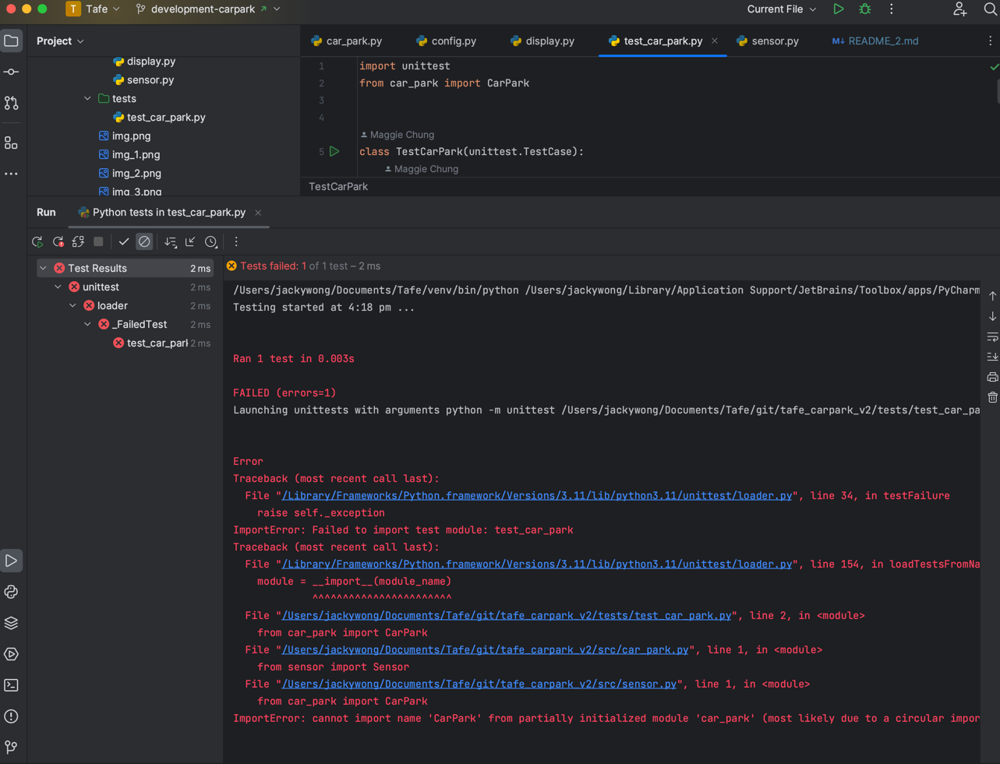

test_car_park_issue_1: Circular import creates an issue
test_car_park_update_1: "from car_park import CarPark" in sensor.py and display.py are removed

Run second unit test:
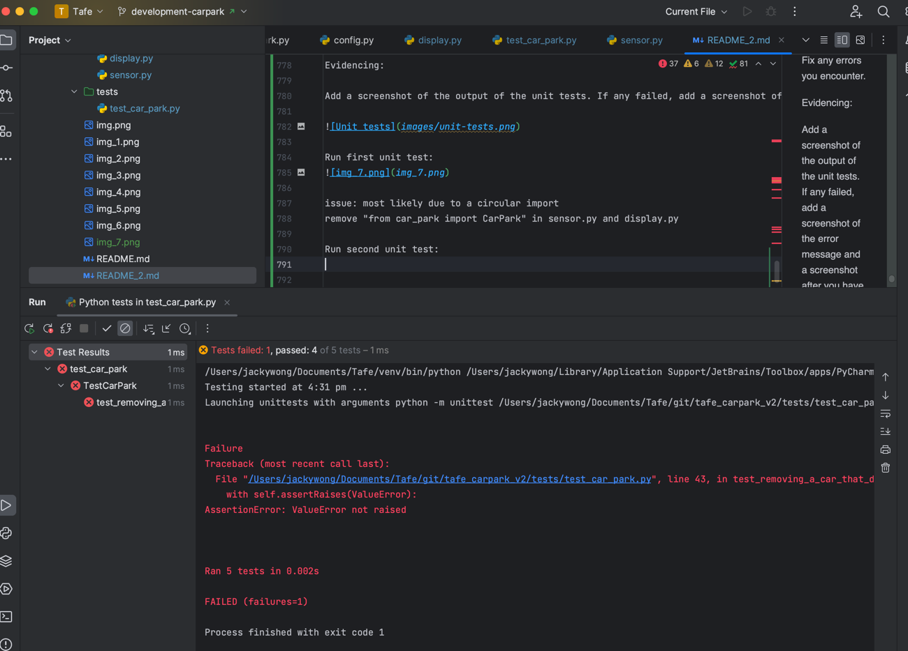

test_car_park_issue_2: Circular import error has been removed; There is an error for testing the test_removing_a_car_that_does_not_exist
test_car_park_update_2: Add else condition (raise ValueError) under remove_car.
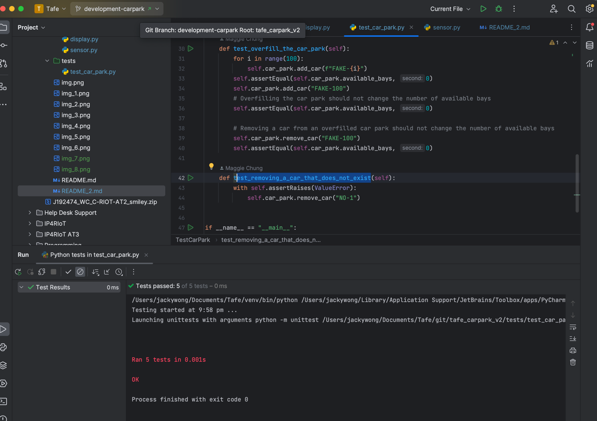

Commit your changes to the local repository. Tag the commit with s6 so your lecturer can find it:

Push the tag to the remote repository:

git push --tags

Display unit tests
Next, we'll create tests for the Display class. These tests will test the __init__ method and the update method.

1. In the tests/ directory, create a new Python file called test_display.py. Notice that tests are usually suffixed or prefixed with test. Typically, a unit applies to a class. So the unit tests for the Display class are in the test_display.py file.

2. Add the following import statement to the top of the file:

import unittest
from display import Display
from car_park import CarPark

3. Create a TestDisplay class that inherits from unittest.TestCase.

4. Create a setUp method that creates a Display object and a CarPark object. The Display object should have the following attributes:

id: 1
message: "Welcome to the car park"
is_on: True
car_park: CarPark(...)

5. Create a test_display_initialized_with_all_attributes method. This method should test that the Display object was initialized with the correct attributes. Here is a sample implementation:

# ... inside the TestDisplay class
def test_display_initialized_with_all_attributes(self):
   self.assertIsInstance(self.display, Display)
   self.assertEqual(self.display.id, 1)
   self.assertEqual(self.display.message, "Welcome to the car park")
   self.assertEqual(self.display.is_on, True)
   self.assertIsInstance(self.display.car_park, CarPark)

6.  Now create a test_update method. This method should test that the update method updates the message attribute. Here is a sample implementation:

# ... inside the TestDisplay class
def test_update(self):
   self.display.update({"message": "Goodbye"})
   self.assertEqual(self.display.message, "Goodbye")

7. Run the unit test in PyCharm.

8. Fix any errors you encounter.

Evidencing:

1. Add a screenshot of the output of the unit tests. If any failed, add a screenshot of the error message and a screenshot after you have fixed the errors:


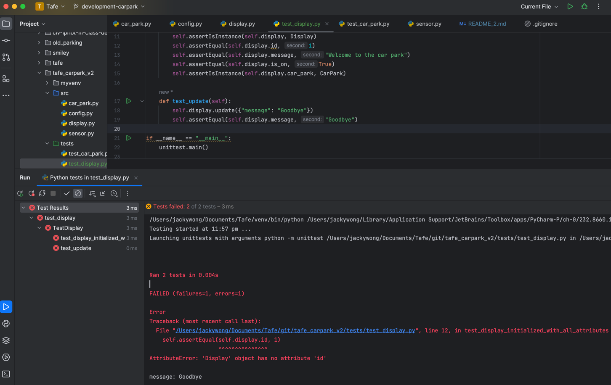
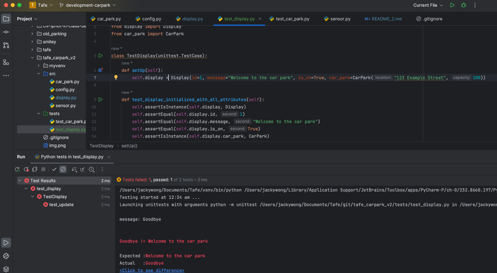

test_display_issue_1: name of attributes - not match; name of "car_park" not defined
test_display_update_1: update display_id to id in display.py; update the setUp method

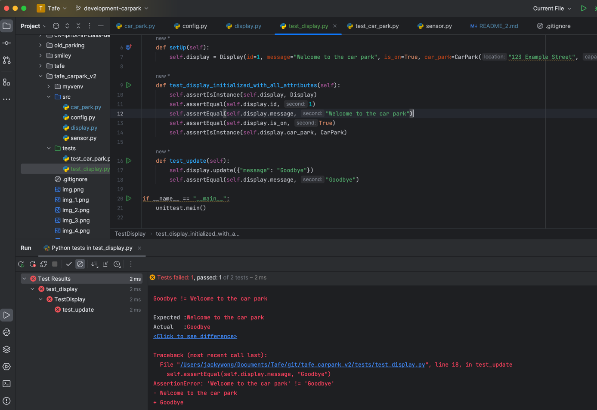

test_display_issue_2: failed to update the display message from "Welcome to the car park" to "Goodbye"
test_display_update_2: modified update method with setattr function (which sets the value of the attribute of an object)

Reference: https://www.programiz.com/python-programming/methods/built-in/setattr

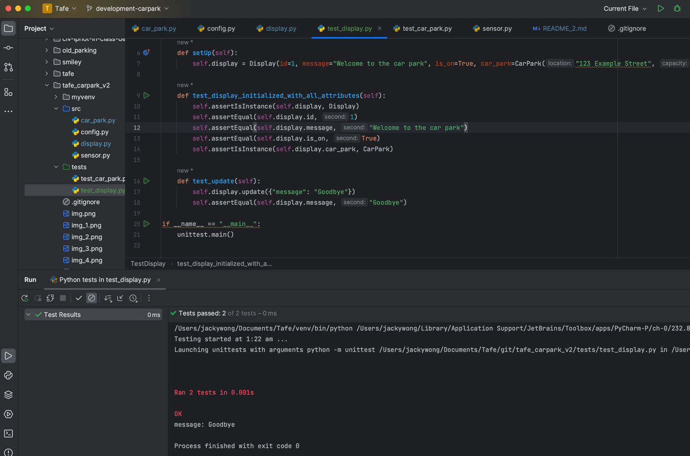

2. Commit your changes to the local repository. Tag the commit with s7 so your lecturer can find it.

3. Push the tag to the remote repository.

git push --tags

Sensor unit tests
Finally, we'll create tests for the Sensor class. These tests will test the __init__ method and the detect_vehicle method. Implement at least two relevant unit tests.

Test the car park register method
The car park register method should accept a Sensor or Display object. It should raise a TypeError if the object is neither a Sensor nor a Display. Before proceeding, think about where you would test this behaviour. Should you test it in the CarPark unit tests or the Sensor unit tests? Why?

Answer here...

Create a new unit test in the test_car_park.py file called test_register_raises_type_error. This test should create a CarPark object and a str object. It should then call the register method on the CarPark object with the str object as a parameter. The test should assert that a TypeError is raised. Here is a sample implementation:

# ... inside the TestCarPark class
with self.assertRaises(TypeError):
   self.car_park.register("Not a Sensor or Display")
Evidencing:
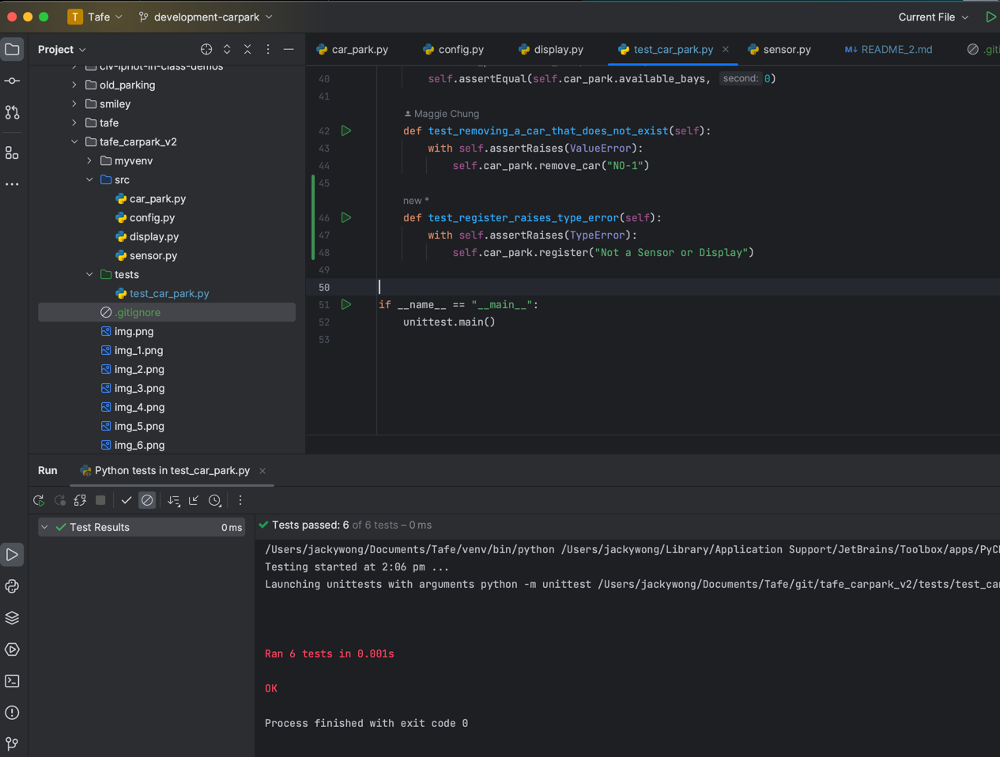

Commit your original test cases for the sensor class to the local repository. Tag the commit with s8 so your lecturer can find it.